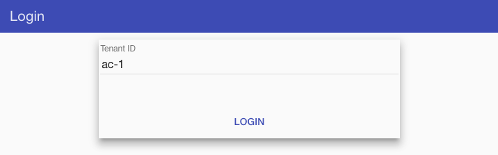
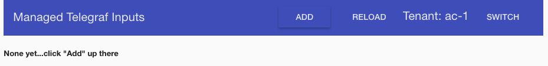
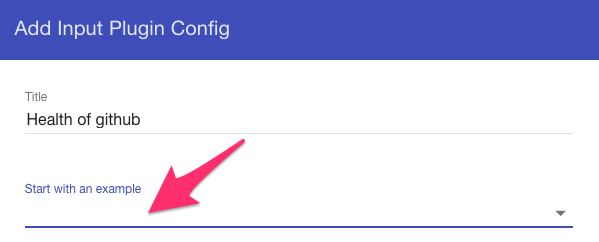
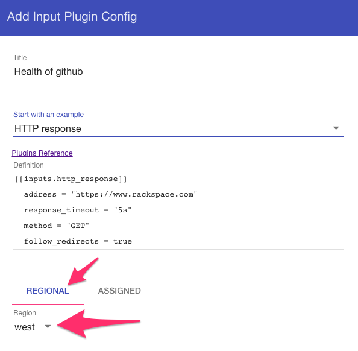
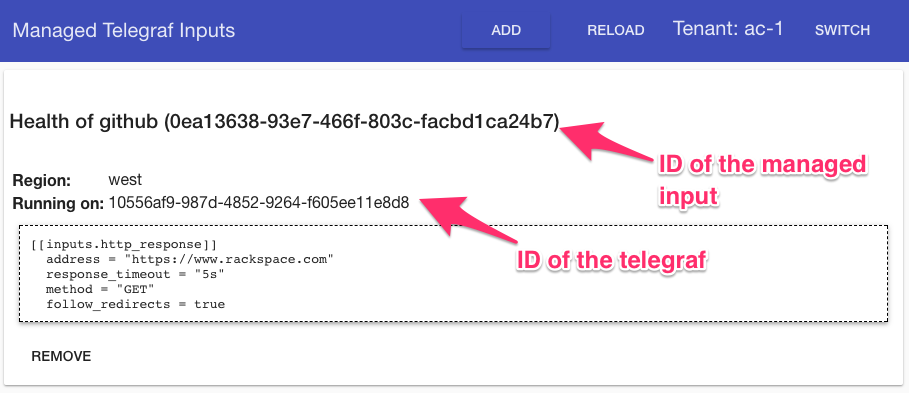
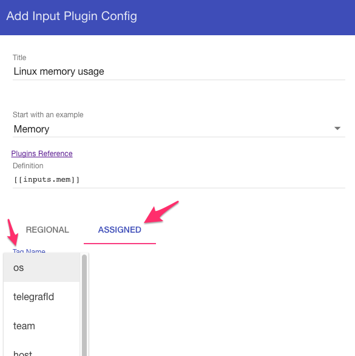
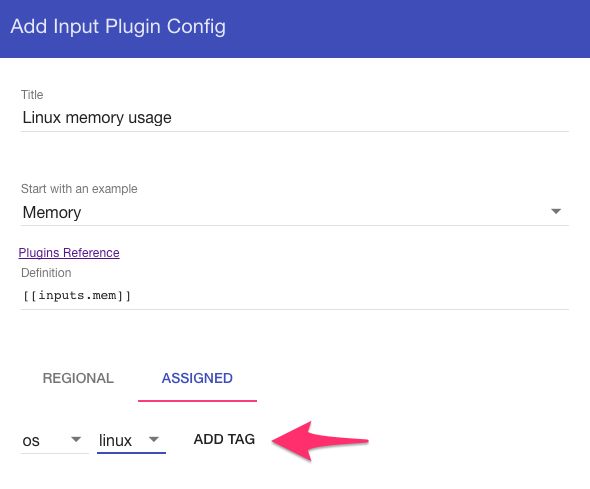
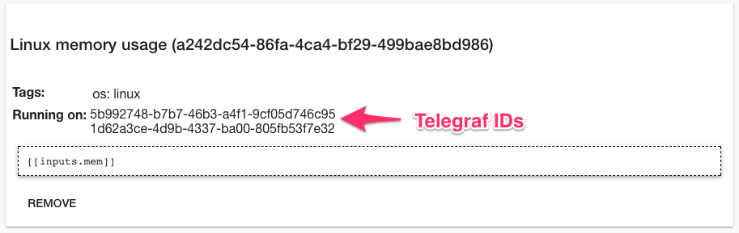

This is a Spring Boot application that accepts gRPC connections from remote telegraf instances and dynamically
manages input plugin configurations for those instances.

This repo is the "Homebase" portion of this diagram:


## Required Telegraf Code

The corresponding enhancement to Telegraf is currently located in the [add-remote-mgmt](https://github.com/rackerlabs/telegraf/tree/add-remote-mgmt)
branch of the [rackerlabs/telegraf fork](https://github.com/rackerlabs/telegraf).

To prepare the image referenced by the Swarm procedure below, clone the repo's branch and build a local image:

```bash
mkdir -p $GOPATH/src/github.com/influxdata
git clone -b add-remote-mgmt https://github.com/rackerlabs/telegraf.git $GOPATH/src/github.com/influxdata/telegraf
cd $GOPATH/src/github.com/influxdata/telegraf
make local-image
```

## Running just Homebase

To get up and running with a local instance of homebase you can either start it up in your IDE of choice or
run it via the integrated Spring Boot maven plugin:

```bash
./mvnw spring-boot:run
```

## Trying it out in Docker Swarm

With the required Telegraf code built as a local image (see above), build a local image of homebase using:

```bash
# in the cloned directory of telegraf-homebase...
make local-image
```

Start the stack using

```bash
make swarm-up
```

That stack includes:
* 2 x Telegraf instances configured for region "west" support
* 2 x Telegraf instances configured for tenant "ac-1" support
* 2 x Homebase instances
* 1 x Cassandra, used as a persistent store for the Apache Ignite data grid formed by the Homebase instances
* Zookeeper, to facilitate grid discovery 
* InfluxDB, configured as default output plugin of telegraf instances
* Grafana, can be configured with an http://influxdb:8086 data source
* A Postgres instance to serve as a backing store for Grafan's dashboards

Homebase has a simple web UI that is accessible at any of the swarm nodes at port **8083**.

Grafana is available at port **3000** at any of the swarm nodes. The default login for grafana is `admin`/`admin`.

The stack can be stopped using

```bash
make swarm-down
```

## Demo

First, we'll startup the demo swarm

```bash
make swarm-up
```

Using `docker ps`, we'll watch and wait for both Homebase instances in the grid to become healthy. While we're
here we can note via the `NAMES` column that there are two regional telegrafs and two tenant-assigned telegrafs.

```text
CONTAINER ID        IMAGE                     COMMAND                  CREATED              STATUS                        PORTS                                         NAMES
fb7db4f56b42        influxdb:latest           "/entrypoint.sh in..."   56 seconds ago       Up 51 seconds                 8086/tcp                                      tremote_influxdb.1.d43i9o7zwh2o5l8gdzlh302vy
a522245dfa53        grafana/grafana:4.4.3     "/run.sh"                About a minute ago   Up 57 seconds                 3000/tcp                                      tremote_grafana.1.sb4tr5bqmlkaqqp2o24tsg67l
1cb6407ed0ce        cassandra:3.0             "/docker-entrypoin..."   About a minute ago   Up 59 seconds (healthy)       7000-7001/tcp, 7199/tcp, 9042/tcp, 9160/tcp   tremote_cassandra.1.n69i3phe95rkf1bpn46ltf4q1
7c33ce258d9f        jplock/zookeeper:latest   "/opt/zookeeper/bi..."   About a minute ago   Up About a minute             2181/tcp, 2888/tcp, 3888/tcp                  tremote_zookeeper.1.j3icinghucolh7lcyz4kn5thk
e27048ec81c4        kapacitor:latest          "/entrypoint.sh ka..."   About a minute ago   Up About a minute             9092/tcp                                      tremote_kapacitor.1.x6274wt94l195iq2381srl3ej
38eccd5f62d7        local/telegraf:latest     "/app/telegraf --r..."   About a minute ago   Up About a minute                                                           tremote_telegraf-regional.1.rqnsqzpr4w2hjh2nyxqc5momy
d15f1badf780        local/telegraf:latest     "/app/telegraf --r..."   About a minute ago   Up About a minute                                                           tremote_telegraf-regional.2.ym71xv35jjygp160x6vshou5c
86290966b727        postgres:9.6-alpine       "docker-entrypoint..."   About a minute ago   Up About a minute             5432/tcp                                      tremote_postgres.1.wctsr15ce42nwk0rwmf1zrrh7
e9c692d55deb        local/telegraf:latest     "/app/telegraf --r..."   About a minute ago   Up About a minute                                                           tremote_telegraf-assigned.2.pwsh3m4tbwg05yv6k695cojya
197b8270bf13        local/telegraf:latest     "/app/telegraf --r..."   About a minute ago   Up About a minute                                                           tremote_telegraf-assigned.1.hopbdqtd12z2n9euexavxp2sy
466ed8f4e8e9        local/homebase:latest     "/usr/bin/java -ja..."   About a minute ago   Up About a minute (healthy)   6565/tcp, 8080/tcp                            tremote_homebase.2.tmulykmvwoeunvz5n8eoimcwl
920076232d82        local/homebase:latest     "/usr/bin/java -ja..."   About a minute ago   Up About a minute (healthy)   6565/tcp, 8080/tcp                            tremote_homebase.1.453521gd3nzf4tbo31ntmg075
```

Looking at the `tremote_telegraf-region` service logs we can see the Regional Telegrafs startup and phone home. 

```text
tremote_telegraf-regional.1.rqnsqzpr4w2h@moby    | 2017-08-11T13:34:48Z I! tid:"10556af9-987d-4852-9264-f605ee11e8d8" region:"west"  phoning home with the tags map[os:linux arch:amd64 host:38eccd5f62d7 region:west]
tremote_telegraf-regional.2.ym71xv35jjyg@moby    | 2017-08-11T13:34:50Z I! tid:"a6c42a04-1d6a-4112-9f71-a9074530d909" region:"west"  phoning home with the tags map[host:d15f1badf780 os:linux arch:amd64 region:west]
```

Note the presence of `region` as part of the identifiers indicates to homebase that this is a "regional telegraf" 
meaning that it is measuring a region's ability to remotely interrogate many tenants' devices via 
input plugins like `http_response`.

Looking at the `tremote_telegraf-assigned` service logs we can see the Assignable Telegrafs startup and phone home. 

```text
tremote_telegraf-assigned.1.hopbdqtd12z2@moby    | 2017-08-11T13:34:50Z I! tid:"1d62a3ce-4d9b-4337-ba00-805fb53f7e32" tenant:"ac-1"  phoning home with the tags map[os:linux arch:amd64 tenantId:ac-1 team:dev host:197b8270bf13]
tremote_telegraf-assigned.2.pwsh3m4tbwg0@moby    | 2017-08-11T13:34:50Z I! tid:"5b992748-b7b7-46b3-a4f1-9cf05d746c95" tenant:"ac-1"  phoning home with the tags map[os:linux arch:amd64 tenantId:ac-1 team:dev host:e9c692d55deb]
```

Note the presence of `tenantId` instead of `region` indicates to homebase that this is an "assignable telegraf" 
meaning that it is running on a tenant's specific device. Also note that the tags reported by this telegraf are
a combination of the following configuration and discovery:

From standard telegraf logic:
* host:197b8270bf13

_FYI, that hostname is ugly because it is the Docker container's ID/hostname_

From discovery logic during phone-home:
* os:linux
* arch:amd64

From the command-line `--tags tenantId=ac-1:team=dev`
* tenantId:ac-1
* team:dev

Now, let's move over to the web interface http://localhost:8083/, 
which is a thin, demonstrable layer over the Homebase REST API.

We start with a "login" screen which really does no authentication at all. It's just a graphical way to let
us switch between invoking the REST API on behalf of different tenants for demo-sake:



We'll pretend to be the tenant "ac-1" ("ac" short for account) and there's nothing configured yet, as expected:



However, if we restart the whole swarm after this demo you will still see the prior configurations since the 
Cassandra container is volume-attaching its data store. 

_Quick note: Cassandra is used as write-through store for the managed input Ignite cache._

Let's add a regional managed input that checks the health of github.com, pretending "ac-1" is the tenant that
runs and cares about the health of that. In this case, there's an example "HTTP Response" input, so we'll just pick
that from the drop down:



With the definition, which is nothing more than a telegraf config snippet, populated let's pick a region to
run this input. The demo swarm only fires up regional telegrafs claiming to be in "west", so we'll pick that.



Now, we add that and if we had watched the telegraf logs with `make watch-telegraf-regional-logs` we would have
seen that input get picked up and sent to **only one** of the two telegrafs running in "west":

```text
tremote_telegraf-regional.1.rqnsqzpr4w2h@moby    | 2017-08-11T14:00:50Z I! Received config pack: new:<id:"0ea13638-93e7-466f-803c-facbd1ca24b7" tenantId:"ac-1" definition:"[[inputs.http_response]]\n  address = \"https://www.rackspace.com\"\n  response_timeout = \"5s\"\n  method = \"GET\"\n  follow_redirects = true" title:"Health of github" >
tremote_telegraf-regional.1.rqnsqzpr4w2h@moby    | 2017-08-11T14:00:50Z I! Starting managed input 0ea13638-93e7-466f-803c-facbd1ca24b7
```

Soon after, that telegraf starts to gather and output the newly configured http_remote metric. We see this output
from the telegraf container because an `[[outputs.file]]` was configured with `stdout` as the file. 

```text
tremote_telegraf-regional.1.rqnsqzpr4w2h@moby    | http_response,host=38eccd5f62d7,server=https://www.rackspace.com,method=GET,telegrafId=10556af9-987d-4852-9264-f605ee11e8d8,tenantId=ac-1,title=Health\ of\ github,managedId=0ea13638-93e7-466f-803c-facbd1ca24b7,region=west response_time=0.32347758,http_response_code=200i,result_type="success" 1502460051000000000
tremote_telegraf-regional.1.rqnsqzpr4w2h@moby    | http_response,host=38eccd5f62d7,server=https://www.rackspace.com,method=GET,managedId=0ea13638-93e7-466f-803c-facbd1ca24b7,telegrafId=10556af9-987d-4852-9264-f605ee11e8d8,tenantId=ac-1,title=Health\ of\ github,region=west response_time=0.247704484,http_response_code=200i,result_type="success" 1502460061000000000
```

Over in the web interface we can confirm that the newly added regional input is running on that telegraf instance
by cross-checking the ugly UUIDs:



Now, let's add an "assigned input" that we want to gather memory statistics on all of our linux nodes. This time
we'll use the "Memory" example, choose "Assigned" type, and start selecting tags. The tags and their values in
the drop downs are queried from Homebase, which in turn is tracking what tags and their values are actively in
use by that tenant. That ensures that each tenant can use and see only their particular tagging scheme for their
telegrafs.



We'll add that tag and then finish by adding the input to the system. More tags can also be added to the input
configuration and will be effectively AND'ed when looking for telegraf that can be assigned this input.



Watching the assignable telegraf logs using `make watch-telegraf-assigned-logs` we can see that this time
both telegrafs are assigned and running the `mem` input. It was assigned to both since they both advertised the
`os:linux` tag. If we had configured this input with another, more specific tag such as `host` then it would have
constrained the assignment to only the telegraf running on that host.

```text
tremote_telegraf-assigned.2.pwsh3m4tbwg0@moby    | 2017-08-11T14:13:36Z I! Received config pack: new:<id:"a242dc54-86fa-4ca4-bf29-499bae8bd986" tenantId:"ac-1" definition:"[[inputs.mem]]" title:"Linux memory usage" >
tremote_telegraf-assigned.2.pwsh3m4tbwg0@moby    | 2017-08-11T14:13:36Z I! Starting managed input a242dc54-86fa-4ca4-bf29-499bae8bd986
tremote_telegraf-assigned.1.hopbdqtd12z2@moby    | 2017-08-11T14:13:36Z I! Received config pack: new:<id:"a242dc54-86fa-4ca4-bf29-499bae8bd986" tenantId:"ac-1" definition:"[[inputs.mem]]" title:"Linux memory usage" >.
tremote_telegraf-assigned.1.hopbdqtd12z2@moby    | 2017-08-11T14:13:36Z I! Starting managed input a242dc54-86fa-4ca4-bf29-499bae8bd986
.
.
.
tremote_telegraf-assigned.2.pwsh3m4tbwg0@moby    | mem,title=Linux\ memory\ usage,team=dev,host=e9c692d55deb,managedId=a242dc54-86fa-4ca4-bf29-499bae8bd986,telegrafId=5b992748-b7b7-46b3-a4f1-9cf05d746c95,tenantId=ac-1 free=217427968i,cached=695169024i,buffered=282615808i,inactive=527257600i,used_percent=77.3516867386421,available_percent=22.648313261357902,used=3201687552i,available=937443328i,active=3172651008i,total=4139130880i 1502460817000000000
tremote_telegraf-assigned.1.hopbdqtd12z2@moby    | mem,team=dev,host=197b8270bf13,managedId=a242dc54-86fa-4ca4-bf29-499bae8bd986,telegrafId=1d62a3ce-4d9b-4337-ba00-805fb53f7e32,tenantId=ac-1,title=Linux\ memory\ usage total=4139130880i,available=936935424i,free=216920064i,cached=695173120i,buffered=282615808i,active=3173134336i,inactive=527257600i,used_percent=77.36395752723818,used=3202195456i,available_percent=22.63604247276182 1502460817000000000
```

At this point, it's worth pointing out that after the metric name of `mem` we can see the managed inputs get 
automatically enriched with a few tags. This way every metric stored in Influx (or your backend of choice) can filter
and query based upon the things like the original input ID regardless of system restarts, etc.

From the configuration discussed above:
* team=dev
* host=197b8270bf13
* tenantId=ac-1
* telegrafId=1d62a3ce-4d9b-4337-ba00-805fb53f7e32

And each specific managed input is tagged with its homebase identifier and the title given:
* managedId=a242dc54-86fa-4ca4-bf29-499bae8bd986
* title=Linux\ memory\ usage

Over in the web interface we can confirm and cross-check that those two telegrafs are being tracked as having
been assigned that input configuration:



At this point we could play with scaling down and up the telegraf instances, killing off a Homebase instance at a 
time, and all would coordinate re-assigning and tracking of inputs.