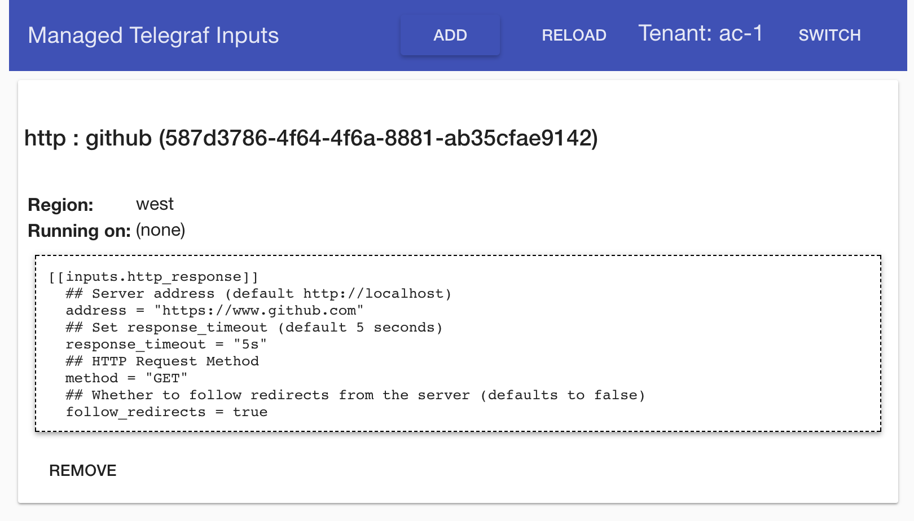
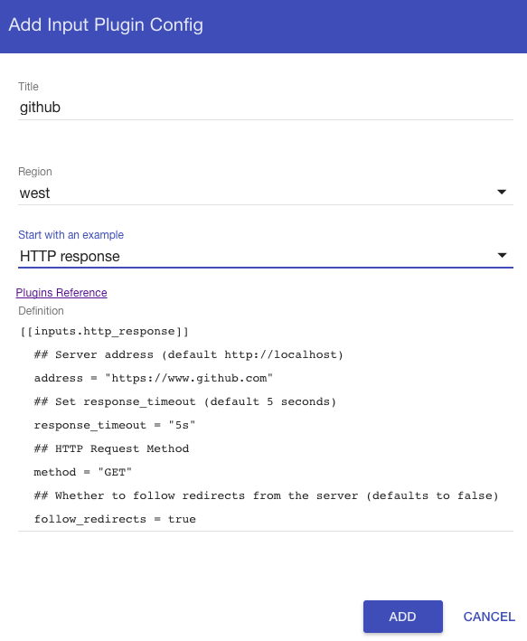

This is a Spring Boot application that accepts gRPC connections from remote telegraf instances and dynamically
manages input plugin configurations for those instances.

This repo is the "Homebase" portion of this diagram:


## Required Telegraf Code

The corresponding enhancement to Telegraf is currently located in the [add-remote-mgmt](https://github.com/rackerlabs/telegraf/tree/add-remote-mgmt)
branch of the [rackerlabs/telegraf fork](https://github.com/rackerlabs/telegraf).

To prepare the image referenced by the Swarm procedure below, clone the repo's branch and build a local image:

```bash
mkdir -p $GOPATH/src/github.com/influxdata
git clone -b add-remote-mgmt https://github.com/rackerlabs/telegraf.git $GOPATH/src/github.com/influxdata/telegraf
cd $GOPATH/src/github.com/influxdata/telegraf
make local-image
```

## Running just Homebase

To get up and running with a local instance of homebase you can either start it up in your IDE of choice or
run it via the integrated Spring Boot maven plugin:

```bash
./mvnw spring-boot:run
```

## Trying it out in Docker Swarm

With the required Telegraf code built as a local image (see above), build a local image of homebase using:

```bash
# in the cloned directory of telegraf-homebase...
make local-image
```

Start the stack using

```bash
make swarm-up
```

That stack includes:
* 2 x Telegraf ready to be managed
* 1 x Homebase instances (but can be scaled > 1)
* 1 x Cassandra, used as a persistent store for the stored config cache
* Zookeeper, to coordinate Apache Ignite grid of homebase instances
* InfluxDB, configured as default output plugin of telegraf instances
* Grafana, can be configured with an http://influxdb:8086 data source

Homebase has a simple web UI that is accessible at any of the swarm nodes at port **8083**.

Grafana is available at port **3000** at any of the swarm nodes.

The stack can be stopped using

```bash
make swarm-down
```

## Screenshots

#### HTTP response inputs configured and allocated for two regions



#### Configuring an HTTP response input

